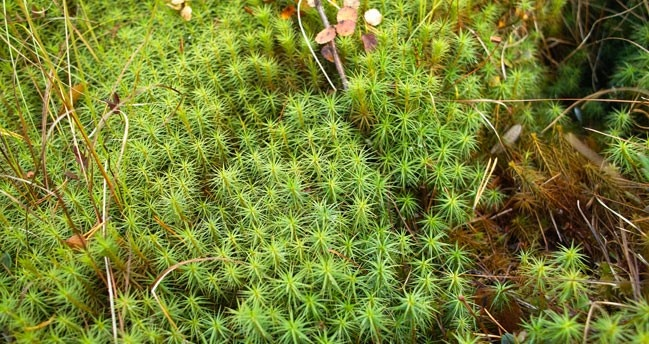

# Family Riccia

Quite a large genus, which includes about 200 species, distributed in all parts of the world, especially in the southern regions. Riccia are inhabitants of damp soils. Aquatic species of Riccia settle in the reservoirs, the thallus of which has a very interesting reticular shape.

Terrestrial riccia species have small, multi-layered rosette-like and bifurcated (dichotomously) thalli. Riccia is well known to aquarists.

In its dense thickets, fish fry can easily develop.

## Class Leaf mosses, or Bryopsids

This is the largest class of bryophytes, it includes more than 15,000 species (according to other sources, about 18,000 species). Representatives of leafy mosses on land are found everywhere from the polar deserts of the Arctic to peculiar areas of life - "oases" in Antarctica.

Leaf mosses are highly resistant to life, survive in adverse conditions and are of great importance in the general photosynthetic activity of the plant world on our planet.
 
Spores of leafy mosses are highly viable. Their frost resistance is striking: air-dry spores, after freezing them at a temperature of -200 ° C, germinated normally on nutrient media. Spores germinated just as well after heating to 100 ° C. Therefore, it is not surprising that in places of strong forest fires there is a massive appearance of mosses.

From leafy mosses, loose or dense extensive covers are formed, which retain moisture for a long time and thereby contribute to the general supply of water to the soil.

Some mosses can withstand drying out because their growth points are protected from drying out, as the clavate end cells at the tops of the stems secrete mucus.

The name of leafy mosses reflects the main features of their structure: the stems are covered with small whole sessile leaves, with or without veins. In some types of mosses, the leaves are located on the stems from all sides - radially, in others, the arrangement of the leaves is bilateral.

Bryopsids have no roots, their function is performed by rhizoids. An interesting phenomenon is observed in leafy mosses. Hair-like formations - rhizoids develop not only from the base of the stems, but often throughout the stem, and even from the lower part of the leaves.
 
Rhizoids have the form of single-row multicellular filaments with brown membranes. In some mosses, the entire surface of the stem is covered with such rhizoids as dense pubescence. It seems that the stems are covered with a kind of felt. The color of the rhizoid felt is different: light, brown, reddish, violet. Mosses look very interesting, in which the pubescence on the stems curls into long strands. The rhizoids extending from the base of the stems provide the moss with anchorage to the soil and the supply of moisture.

Thanks to the stem rhizoids, each moss plant is in a kind of moist shell, like in a fur coat. Such a water "coat" is created due to the fact that the hairs of the stem or lamellar rhizoids create a capillary space, which not only attracts but also retains water molecules. Soil moisture rises through the thin gaps between the rhizoids, like through capillaries.

In aquatic species of leafy mosses, rhizoids perform the function of attachment to various underwater substrates (supports).

Another surprising feature is observed in the structure of some types of leafy mosses, the stems of which are covered with greenish tender pubescence. Such pubescence is formed by green outgrowths, each of which has a most often finger-dissected shape, but may have other forms.

These peculiar greenish outgrowths, similar to modified leaves, are called paraphyllia (from the Greek para - near and phyllon - leaf). Paraphyllia are arranged irregularly on the stems. Paraphyllia, like rhizoids, can contribute not only to the conduction, but also the preservation of water molecules.

Green paraphyllia are involved in the process of photosynthesis.

The sporogons of leafy mosses in some species are located on the tops of the stems, in others they are lateral. In sporogones, spores mature, which, under optimal lighting conditions, temperature and humidity, germinate a few days or a few weeks after the rash from the capsules. In the process of spore germination, a primary protonema develops, buds are laid on it, from which young plants of leafy mosses grow.

Bryopsids, which play a much greater role in the vegetation cover than other bryophytes, consist of three subclasses: Sphagnidae, Andreaeidae, and Bryidae.

